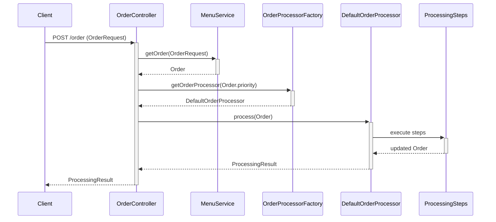

```mermaid
sequenceDiagram
    participant Client
    participant OrderController
    participant MenuService
    participant OrderProcessorFactory
    participant DefaultOrderProcessor
    participant ProcessingSteps

    Client->>+OrderController: POST /order (OrderRequest)
    OrderController->>+MenuService: getOrder(OrderRequest)
    MenuService-->>-OrderController: Order
    OrderController->>+OrderProcessorFactory: getOrderProcessor(Order.priority)
    OrderProcessorFactory-->>-OrderController: DefaultOrderProcessor
    OrderController->>+DefaultOrderProcessor: process(Order)
    DefaultOrderProcessor->>+ProcessingSteps: execute steps
    ProcessingSteps-->>-DefaultOrderProcessor: updated Order
    DefaultOrderProcessor-->>-OrderController: ProcessingResult
    OrderController-->>-Client: ProcessingResult
```
